Task Management System

Task Management System is a web application that allows users to create, manage, and track tasks. It provides a user-friendly interface for organizing tasks efficiently.

 Table of Contents

- [Task Management System](#task-management-system)
  - [Table of Contents](#table-of-contents)
  - [Description](#description)
  - [Demo](#demo)
  - [Features](#features)
  - [Getting Started](#getting-started)
    - [Prerequisites](#prerequisites)
    - [Installation](#installation)
  - [Usage](#usage)
  - [Contributing](#contributing)
  - [License](#license)
  - [Acknowledgments](#acknowledgments)

Description

The Task Management System is a web-based application designed to help users manage their tasks effectively. It allows users to create tasks, set due dates, assign tasks to specific users, mark tasks as completed, and search for tasks based on various criteria.

Technologies Used

- Java
- Spring Boot
- Spring Data JPA
- Thymeleaf (for frontend templates)
- HTML/CSS
- Bootstrap

Demo

You can access a live demo of the Task Management System [here](#insert-demo-link).

Features

- User Registration: Users can create an account to access the system.
- Task Creation: Users can create new tasks with titles, descriptions, due dates, and assign them to specific users.
- Task Listing: Users can view a list of all tasks.
- Task Search: Users can search for tasks by title, description, status, or due date.
- Task Update: Users can update task details, including status and due date.
- Task Deletion: Users can delete tasks.
- User Management: Administrators can manage user accounts, including creation, deletion, and updates.
- Responsive Design: The application is responsive and works well on both desktop and mobile devices.

Getting Started

Follow these instructions to get a copy of the project up and running on your local machine.

Prerequisites

Before you begin, ensure you have met the following requirements:

- Java Development Kit (JDK) installed
- Maven build tool installed
- MySQL database server installed and running
Installation

1. Clone the repository:

   `bash
   git clone https://github.com/your-username/task-management-system.git
   ```

2. Navigate to the project directory:

   ```bash
   cd task-management-system
   ```

3. Build the project using Maven:

   ```bash
   mvn clean install
   ```

4. Configure the database connection in the `application.properties` file.

5. Run the application:

   ```bash
   java -jar target/task-management-system-1.0.jar
   ```

6. Access the application in your web browser at `http://localhost:8080`.

Usage

1. Create a user account to log in to the system.
2. Create tasks and assign them to users.
3. View, update, and delete tasks.
4. Search for tasks based on various criteria.
5. Manage user accounts if you have administrator privileges.

Contributing

If you'd like to contribute to this project, please follow these guidelines:

1. Fork the repository.
2. Create a new branch for your feature or bug fix.
3. Make your changes and ensure the code style and formatting are consistent.
4. Test your changes thoroughly.
5. Create a pull request with a clear description of your changes.

License

This project is licensed under the MIT License. See the [LICENSE](LICENSE) file for details.

Acknowledgments

- Special thanks to the open-source community for providing valuable libraries and tools used in this project.

---

Feel free to customize this README to fit your project's specific details and requirements. Providing comprehensive documentation and clear instructions will help users and contributors understand and use your Task Management System effectively.

Hear some screen shot of project
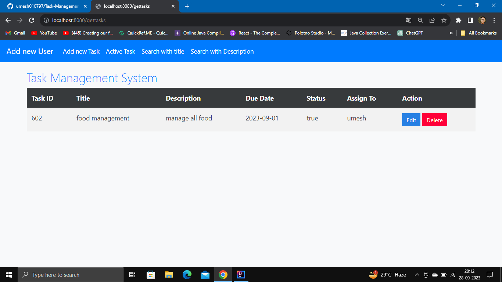
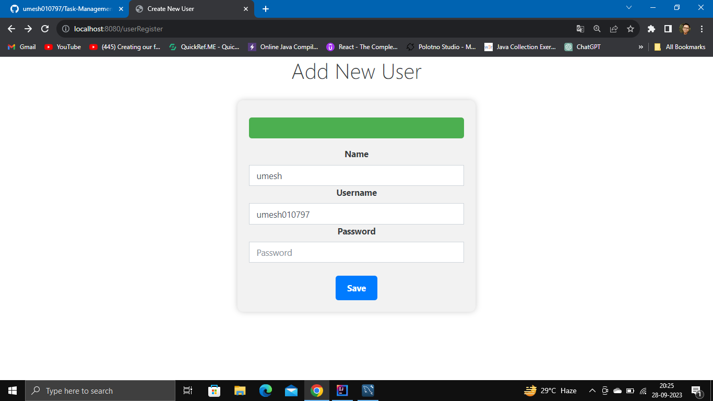
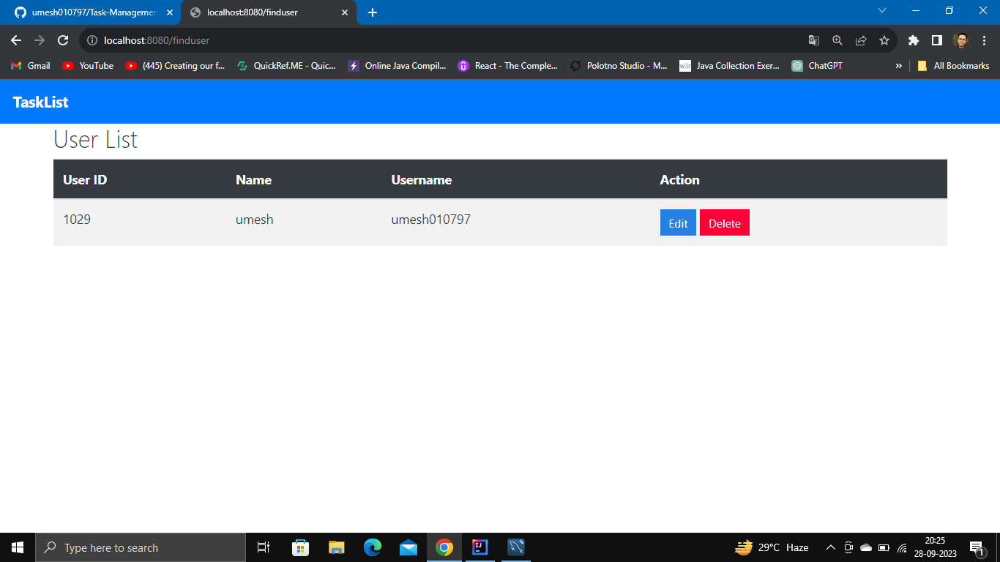
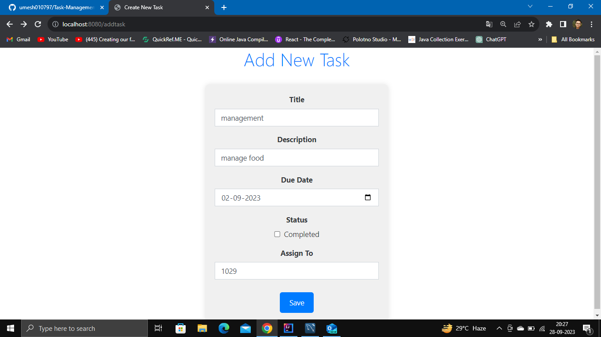
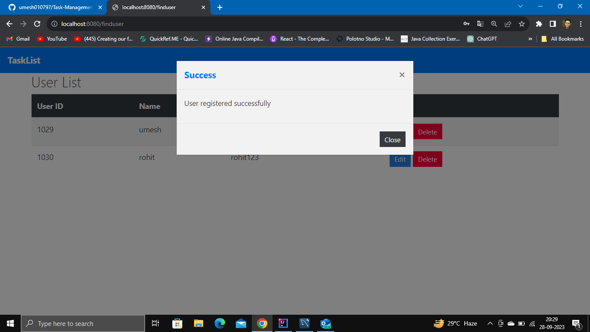
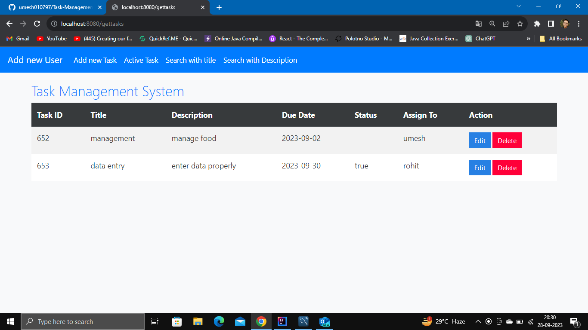
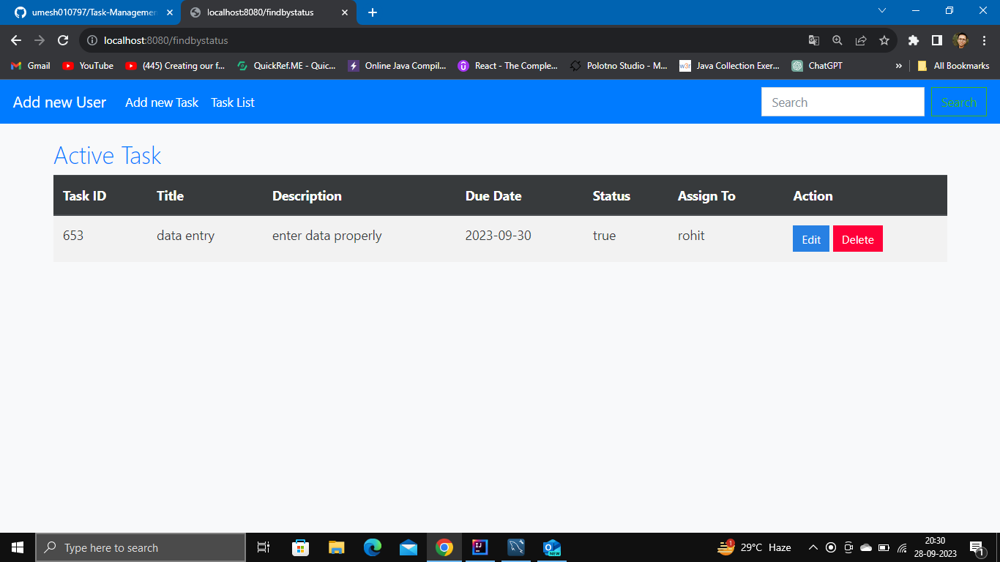
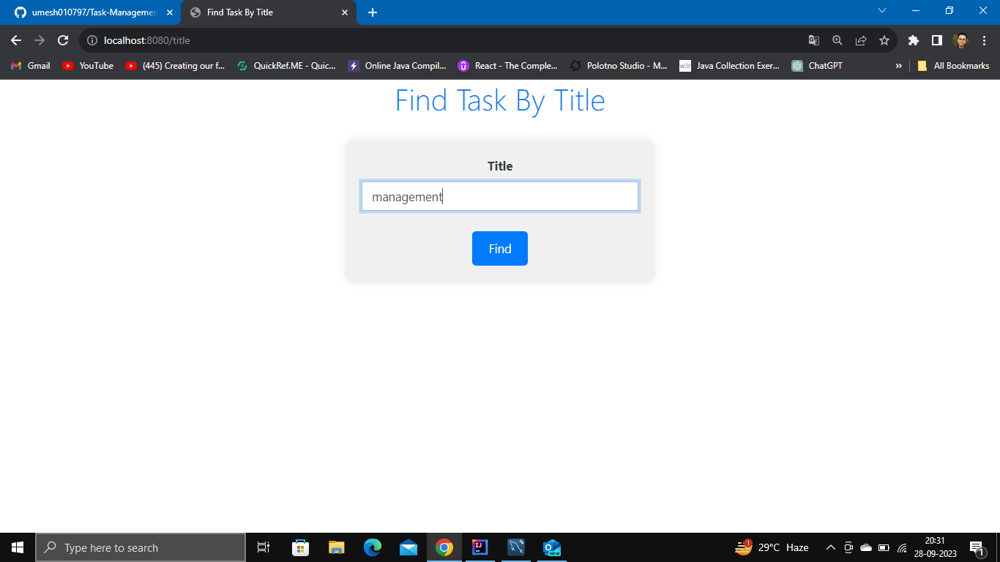

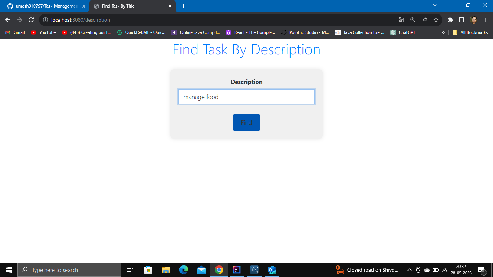
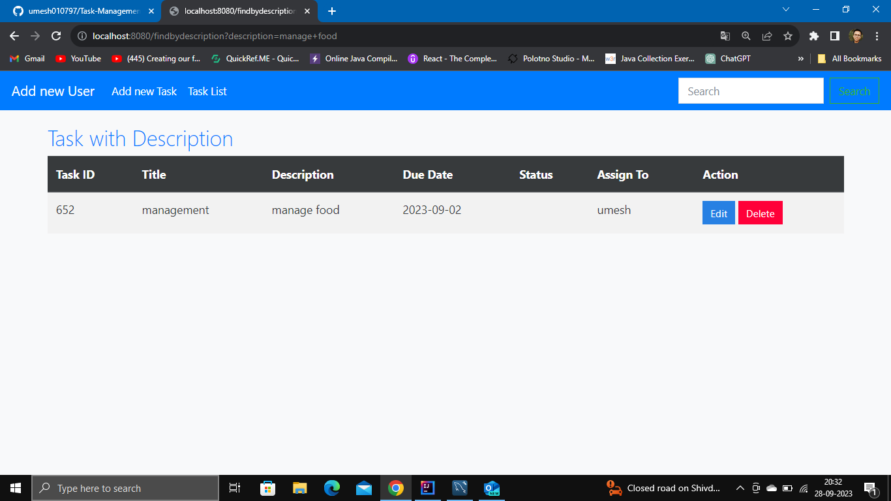
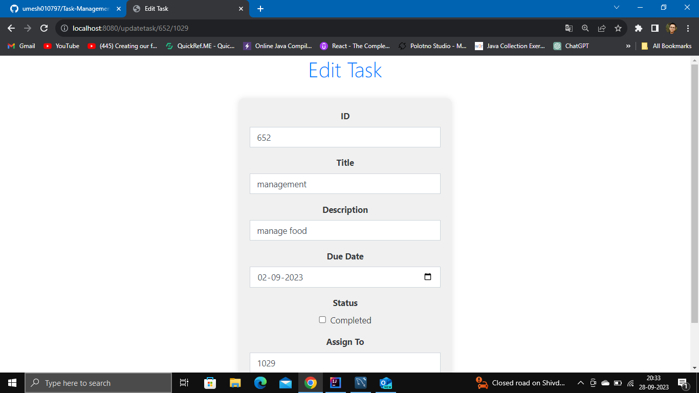
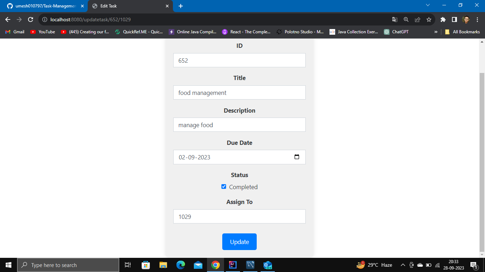
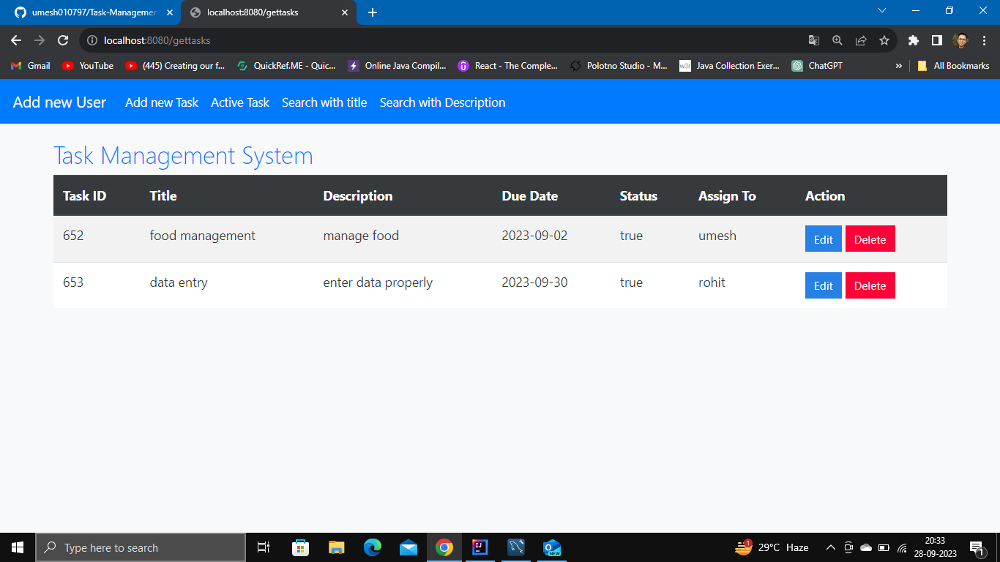
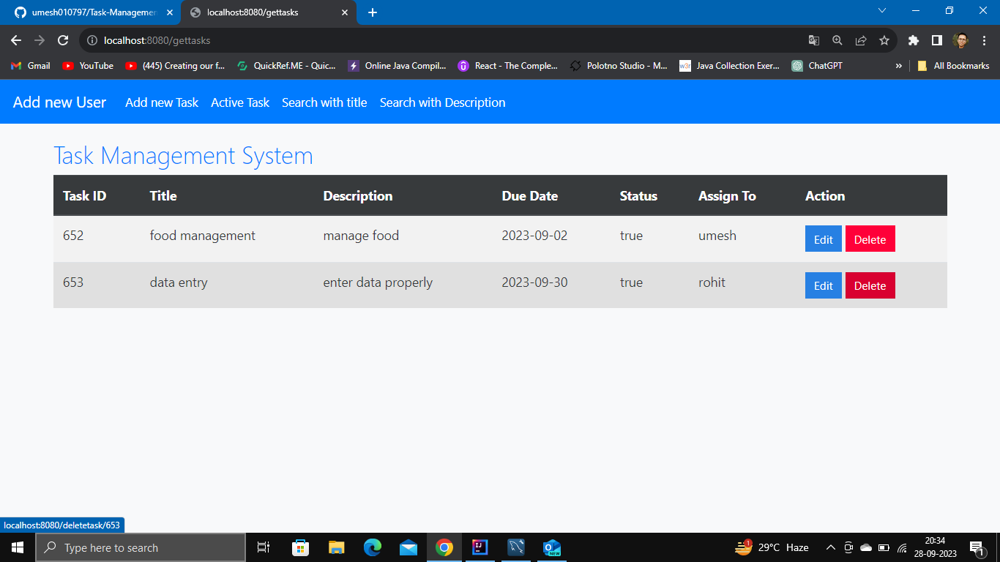
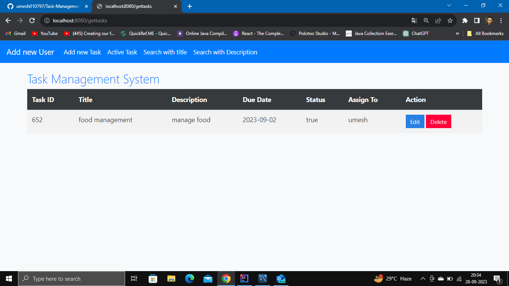

 
 
 
 
 
 
 
 
 
 
 
 
